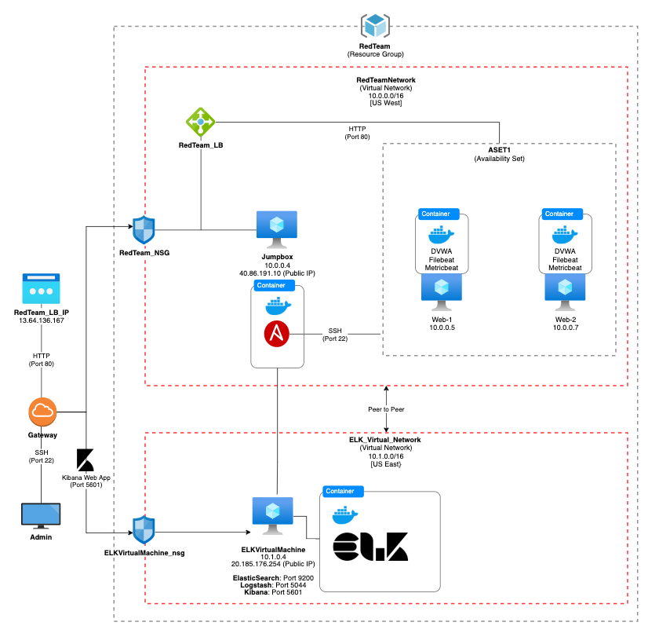

## Automated ELK Stack Deployment

The files in this repository were used to configure the network depicted below.



These files have been tested and used to generate a live ELK deployment on Azure. They can be used to either recreate the entire deployment pictured above. Alternatively, select portions of the .yml file may be used to install only certain pieces of it, such as Filebeat.

  - [ELK](https://github.com/kcsliang/project-1/blob/main/yml-files/elk.yml)
  - [DVWA](https://github.com/kcsliang/project-1/blob/main/yml-files/dvwa.yml)
  - [Filebeat](https://github.com/kcsliang/project-1/blob/main/yml-files/filebeat.yml)
  - [Metricbeat](https://github.com/kcsliang/project-1/blob/main/yml-files/metricbeat.yml)

This document contains the following details:
- Description of the Topology
- Access Policies
- ELK Configuration
  - Beats in Use
  - Machines Being Monitored
- How to Use the Ansible Build


### Description of the Topology

The main purpose of this network is to expose a load-balanced and monitored instance of DVWA, the D*mn Vulnerable Web Application.

Load balancing ensures that the application will be highly reliable, in addition to restricting access to the network.
- The load balancer protects the **availability** aspect of security. The off-loading function of a load balancer defends against distributed denial of service (DDoS) attacks. 
- The jump box is a secure device that all admins first connect to before launching any administrative task. It is an origin point used to connect to other servers or untrusted environments, like the internet.

Integrating an ELK server allows users to easily monitor the vulnerable VMs for changes to the network traffic and system logs.
- Filebeat monitors the log files or locations that you specify, collects log events and forwards them to Elasticsearch or Logstash for indexing.
- Metricbeat collects system-level CPU usage, memory, file system, disk IO, and network IO statistics,  as well as top-like statistics for every process running on your systems.

The configuration details of each machine may be found below.

| Name              | Function           | IP Address | Operating System |
|-------------------|--------------------|------------|------------------|
| Jump Box          | Gateway            | 10.0.0.4   | Linux            |
| Web-1             | Application        | 10.0.0.5   | Linux            |
| Web-2             | Application        | 10.0.0.7   | Linux            |
| ELKVirtualMachine | Logging/Monitoring | 10.1.0.4   | Linux            |

### Access Policies

The machines on the internal network are not exposed to the public Internet. 

Only the Jump Box machine can accept connections from the Internet. Access to this machine is only allowed from the following IP addresses:
- 76.69.119.191

Machines within the network can only be accessed by Jump Box.
- IP of Jump Box: 10.1.0.4

A summary of the access policies in place can be found in the table below.

| Name          | Publicly Accessible | Allowed IP Address       |
|---------------|---------------------|--------------------------|
| Jump Box      | Yes                 | 76.69.119.191            |
| Web-1         | No                  | 10.0.0.4                 |
| Web-2         | No                  | 10.0.0.4                 |
| Load Balancer | Yes                 | 76.69.119.191            |
| ELK Server    | Yes                 | 10.0.0.4 / 76.69.119.191 |


### Elk Configuration

Ansible was used to automate configuration of the ELK machine. No configuration was performed manually; this is advantageous because it allows us to setup highly complex IT workflows. You can customize it based on your needs.

The playbook implements the following tasks:

- Install Docker.io
- Install Python pip3
- Install PythonDocker Python Module
- Install Increase Virtual Memory
- Download and Launch a Docker ELK Container


The following screenshot displays the result of running `docker ps -a` after successfully configuring the ELK instance.


### Target Machines & Beats
This ELK server is configured to monitor the following machines:
- 10.0.0.5 (Web-1) 
- 10.0.0.7 (Web-2)

We have installed the following Beats on these machines:
- Filebeat
- Metricbeat

These Beats allow us to collect the following information from each machine:
- Filebeat collects network related logs, which is used to track information like unique visitors.
- Metricbeat collects system related logs, which is used to track information like CPU usage and memory usage.


### Using the Playbook
In order to use the playbook, you will need to have an Ansible control node already configured. Assuming you have such a control node provisioned: 

SSH into the control node and follow the steps below:
- Copy the filebeat-config.yml file to /etc/ansible/files.
- Update the filebeat-config.yml file:
- At line 1106:
```
hosts: ["10.1.0.4:9200"]
username: "elastic"
password: "changeme" 
```


- At line 1806:
  - host: "10.1.0.4:5601"


- Run the playbook, and navigate to Kibana via ELK-VM Public IP to check that the installation worked as expected.
  - Navigate to Kibana
  - Click "Add log data"
  - Click "System logs"
  - Click "Check data" at the bottom

This is what you should see if successful.


- Any file that has a .yml extension may be used for the playbook. You may copy it from anywhere, but the destination must be in the /etc/ansible/ folder.
- _Which file do you update to make Ansible run the playbook on a specific machine? How do I specify which machine to install the ELK server on versus which to install Filebeat on?_
- _Which URL do you navigate to in order to check that the ELK server is running?

_As a **Bonus**, provide the specific commands the user will need to run to download the playbook, update the files, etc._